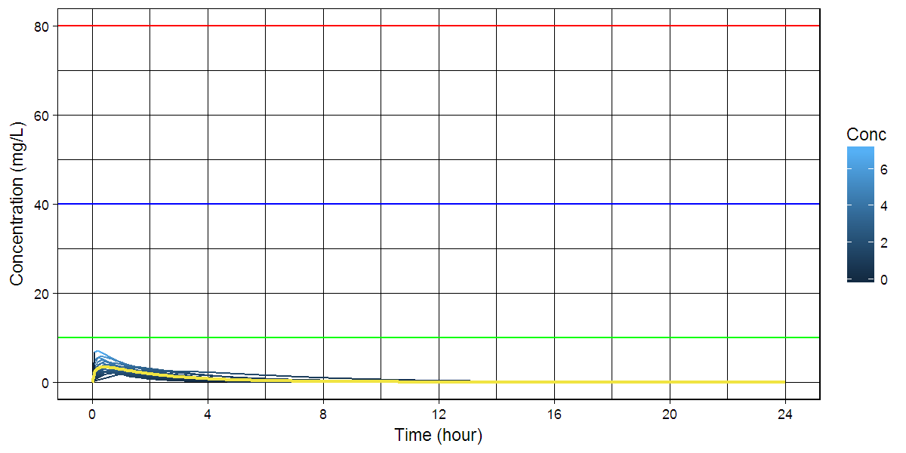
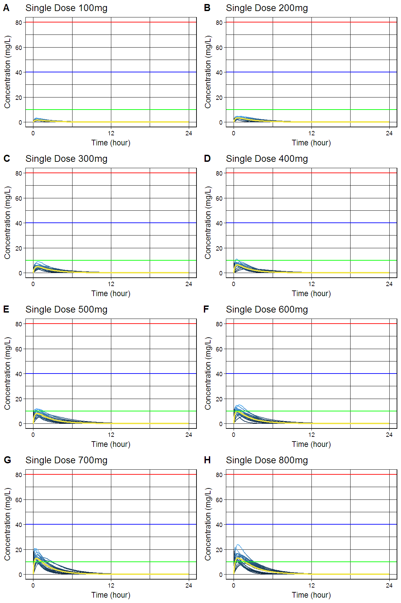
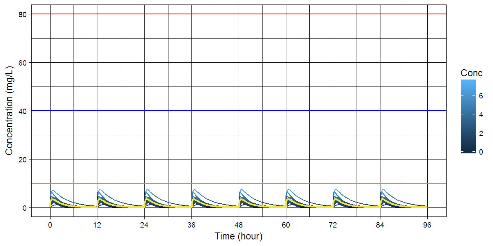
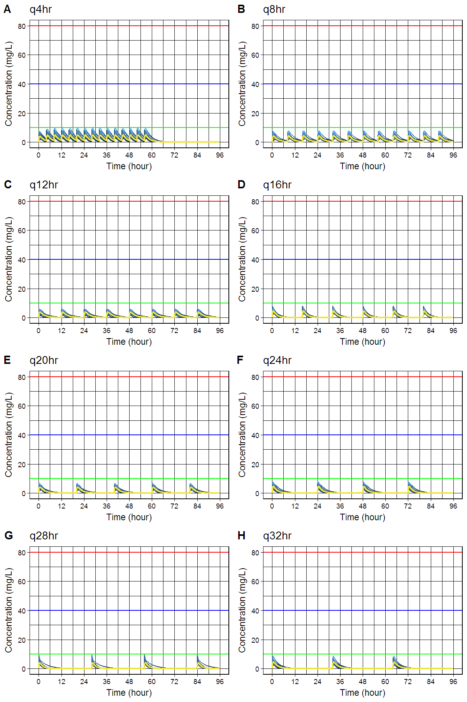

# `busulfansim` R package: Simulation of Plasma Busulfan Concentrations by Using Population Pharmacokinetic Model


[](https://cran.r-project.org/package=busulfansim)

> Simulate plasma busulfan concentrations using population pharmacokinetic model described in Choe, Kim, Lim, Cho, Ghim, Jung, Kim, Noh, Bae and Lee (2012) <doi:10.4196/kjpp.2012.16.4.273>.

- Github: <https://github.com/asancpt/busulfansim>
- Package vignettes and references by `pkgdown`: <http://asancpt.github.io/busulfansim> 

## Installation


```r
install.pacakges("devtools")
devtools::install_github("asancpt/busulfansim")

# Simply create single dose dataset
busulfansim::bsfnPkparam(Weight = 20, Dose = 200, N = 20) 

# Simply create multiple dose dataset
busulfansim::bsfnPkparamMulti(Weight = 20, Dose = 200, N = 20, Tau = 12) 
```

## Single dose

### Create a PK dataset for busulfan single dose


```r
library(busulfansim)
MyDataset <- bsfnPkparam(Weight = 20, Dose = 200, N = 20)
knitr::kable(head(MyDataset), format = 'markdown')
```


| subjid|      Tmax|     Cmax|       AUC| Half_life|       CL|        V|       Ka|        Ke|
|------:|---------:|--------:|---------:|---------:|--------:|--------:|--------:|---------:|
|      1| 0.8645280| 3.806342| 10.530454| 1.1263121| 18.99253| 30.86799| 1.948869| 0.6152824|
|      2| 1.0442513| 3.463465| 12.120699| 1.4942351| 16.50070| 35.57853| 1.717529| 0.4637824|
|      3| 0.6624286| 2.678946|  6.372286| 1.0758509| 31.38591| 48.72519| 2.931934| 0.6441413|
|      4| 0.3175520| 3.427083|  5.530503| 0.8678583| 36.16307| 45.28777| 8.091043| 0.7985175|
|      5| 0.6094890| 3.433842|  9.651271| 1.4578429| 20.72266| 43.59362| 3.949000| 0.4753599|
|      6| 1.1010065| 4.533603| 15.732897| 1.3878079| 12.71222| 25.45760| 1.495829| 0.4993486|

### Create a dataset for concentration-time curve


```r
MyConcTime <- bsfnConcTime(Weight = 20, Dose = 200, N = 20)
knitr::kable(head(MyConcTime), format = 'markdown') 
```


| Subject| Time|     Conc|
|-------:|----:|--------:|
|       1|  0.0| 0.000000|
|       1|  0.1| 2.904707|
|       1|  0.2| 3.951880|
|       1|  0.3| 4.210189|
|       1|  0.4| 4.141132|
|       1|  0.5| 3.943454|

### Create a concentration-time curve


```r
bsfnPlot(MyConcTime)
```

<!-- -->

### Create plots for publication (according to the amount of busulfan)

- `cowplot` package is required


```r
#install.packages("cowplot") # if you don't have it
library(cowplot)

MyPlotPub <- lapply(
  c(seq(100, 800, by = 100)), 
  function(x) bsfnPlotMulti(bsfnConcTime(20, x, 20)) + 
    theme(legend.position="none") + 
    labs(title = paste0("Single Dose ", x, "mg")))

plot_grid(MyPlotPub[[1]], MyPlotPub[[2]],
          MyPlotPub[[3]], MyPlotPub[[4]],
          MyPlotPub[[5]], MyPlotPub[[6]],
          MyPlotPub[[7]], MyPlotPub[[8]],
          labels=LETTERS[1:8], ncol = 2, nrow = 4)
```

<!-- -->

## Multiple dose

### Create a PK dataset for busulfan multiple doses


```r
MyDatasetMulti <- bsfnPkparamMulti(Weight = 20, Dose = 200, N = 20, Tau = 12)
knitr::kable(head(MyDatasetMulti), format = 'markdown') 
```


| subjid|     TmaxS|    CmaxS|      AUCS|       AI|    Aavss|     Cavss|   Cmaxss|    Cminss|
|------:|---------:|--------:|---------:|--------:|--------:|---------:|--------:|---------:|
|      1| 0.6575549| 2.220202|  4.790789| 1.000100| 21.66191| 0.3992325| 3.678731| 0.0003667|
|      2| 0.3459675| 5.811540| 14.533147| 1.003540| 35.34327| 1.2110956| 6.863289| 0.0242139|
|      3| 1.1530714| 2.997588| 12.602648| 1.013413| 46.14802| 1.0502207| 4.602985| 0.0609220|
|      4| 0.8822424| 3.833658| 11.479567| 1.001617| 31.04435| 0.9566306| 6.160117| 0.0099429|
|      5| 0.4099718| 3.109292|  5.246502| 1.000045| 19.93421| 0.4372085| 4.377588| 0.0001963|
|      6| 0.5373787| 4.137364| 10.722551| 1.002296| 32.83157| 0.8935460| 5.444361| 0.0124698|

### Create a dataset for concentration-time curve


```r
MyConcTimeMulti <- bsfnConcTimeMulti(Weight = 20, Dose = 200, N = 20, Tau = 12, Repeat = 10)
knitr::kable(head(MyConcTimeMulti), format = 'markdown')
```


| Subject| Time|     Conc|
|-------:|----:|--------:|
|       1|  0.0| 0.000000|
|       1|  0.1| 1.452191|
|       1|  0.2| 2.284478|
|       1|  0.3| 2.721185|
|       1|  0.4| 2.908080|
|       1|  0.5| 2.939683|

### Create a concentration-time curve


```r
bsfnPlotMulti(MyConcTimeMulti)
```

<!-- -->

### Create plots for publication (according to dosing interval)

- `cowplot` package is required


```r
#install.packages("cowplot") # if you don't have it
library(cowplot)

MyPlotMultiPub <- lapply(
  c(seq(4, 32, by = 4)), 
  function(x) bsfnPlotMulti(bsfnConcTimeMulti(20, 250, 20, x, 15)) + 
    theme(legend.position="none") + 
    labs(title = paste0("q", x, "hr" )))

plot_grid(MyPlotMultiPub[[1]], MyPlotMultiPub[[2]],
          MyPlotMultiPub[[3]], MyPlotMultiPub[[4]],
          MyPlotMultiPub[[5]], MyPlotMultiPub[[6]],
          MyPlotMultiPub[[7]], MyPlotMultiPub[[8]],
          labels=LETTERS[1:8], ncol = 2, nrow = 4)
```

<!-- -->

## Interactive shiny app

```r
bsfnShiny()
```

