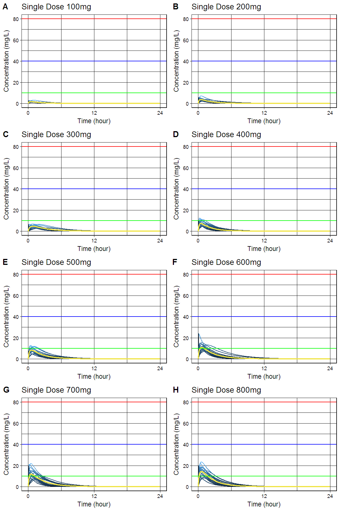

`busulfansim` R package: Simulation of Plasma Busulfan Concentrations by Using Population Pharmacokinetic Model 
========================================================


[](https://cran.r-project.org/package=busulfansim)

> Simulate plasma busulfan concentrations using population pharmacokinetic model described in Choe, Kim, Lim, Cho, Ghim, Jung, Kim, Noh, Bae and Lee (2012) <doi:10.4196/kjpp.2012.16.4.273>.

- Github: <https://github.com/asancpt/busulfansim>
- Package vignettes and references by `pkgdown`: <http://asancpt.github.io/busulfansim> 

## Installation


```r
install.pacakges("devtools")
devtools::install_github("asancpt/busulfansim")

# Simply create single dose dataset
busulfansim::bsfnPkparam(Weight = 20, Dose = 200, N = 20) 

# Simply create multiple dose dataset
busulfansim::bsfnPkparamMulti(Weight = 20, Dose = 200, N = 20, Tau = 12) 
```

## Single dose

### Create a PK dataset for busulfan single dose


```r
library(busulfansim)
MyDataset <- bsfnPkparam(Weight = 20, Dose = 200, N = 20)
knitr::kable(head(MyDataset), format = 'markdown')
```


| subjid|      Tmax|     Cmax|       AUC| Half_life|       CL|        V|        Ka|        Ke|
|------:|---------:|--------:|---------:|---------:|--------:|--------:|---------:|---------:|
|      1| 0.5767079| 3.856945| 12.750493| 1.8447004| 15.68567| 41.75376|  4.789441| 0.3756708|
|      2| 0.5538237| 3.184901|  5.392561| 0.6503104| 37.08813| 34.80346|  2.827778| 1.0656449|
|      3| 0.5772617| 4.216626| 11.617549| 1.4486013| 17.21534| 35.98580|  4.270547| 0.4783925|
|      4| 0.1728366| 2.323294|  3.167900| 0.8159181| 63.13331| 74.33133| 18.754942| 0.8493499|
|      5| 1.0199484| 3.282203| 13.044898| 1.8978537| 15.33166| 41.98738|  2.062794| 0.3651493|
|      6| 0.4464045| 3.985585|  9.753881| 1.3482443| 20.50466| 39.89219|  6.029677| 0.5140018|

### Create a dataset for concentration-time curve


```r
MyConcTime <- bsfnConcTime(Weight = 20, Dose = 200, N = 20)
knitr::kable(head(MyConcTime), format = 'markdown') 
```


| Subject| Time|     Conc|
|-------:|----:|--------:|
|       1|  0.0| 0.000000|
|       1|  0.1| 2.965643|
|       1|  0.2| 4.203926|
|       1|  0.3| 4.650275|
|       1|  0.4| 4.736440|
|       1|  0.5| 4.661575|

### Create a concentration-time curve


```r
bsfnPlot(MyConcTime)
```

<!-- -->

### Create plots for publication (according to the amount of busulfan)

- `cowplot` package is required


```r
#install.packages("cowplot") # if you don't have it
library(cowplot)

MyPlotPub <- lapply(
  c(seq(100, 800, by = 100)), 
  function(x) bsfnPlotMulti(bsfnConcTime(20, x, 20)) + 
    theme(legend.position="none") + 
    labs(title = paste0("Single Dose ", x, "mg")))

plot_grid(MyPlotPub[[1]], MyPlotPub[[2]],
          MyPlotPub[[3]], MyPlotPub[[4]],
          MyPlotPub[[5]], MyPlotPub[[6]],
          MyPlotPub[[7]], MyPlotPub[[8]],
          labels=LETTERS[1:8], ncol = 2, nrow = 4)
```

<!-- -->

## Multiple dose

### Create a PK dataset for busulfan multiple doses


```r
MyDatasetMulti <- bsfnPkparamMulti(Weight = 20, Dose = 200, N = 20, Tau = 12)
knitr::kable(head(MyDatasetMulti), format = 'markdown') 
```


| subjid|     TmaxS|    CmaxS|      AUCS|       AI|    Aavss|     Cavss|   Cmaxss|    Cminss|
|------:|---------:|--------:|---------:|--------:|--------:|---------:|--------:|---------:|
|      1| 0.7888594| 3.467596| 10.851480| 1.004072| 36.23804| 0.9042900| 5.000735| 0.0202825|
|      2| 0.9324679| 3.158090| 13.937638| 1.028223| 55.51025| 1.1614698| 4.293860| 0.1178600|
|      3| 0.8673877| 2.677137|  7.541794| 1.000798| 27.97736| 0.6284828| 4.487030| 0.0035793|
|      4| 0.2297815| 3.665982|  5.987100| 1.000171| 23.00505| 0.4989250| 4.329242| 0.0007390|
|      5| 0.1789700| 4.948107| 10.601323| 1.002164| 32.51695| 0.8834436| 5.434176| 0.0117355|
|      6| 0.8579808| 3.741281| 13.129701| 1.008054| 41.32498| 1.0941418| 5.326850| 0.0425591|

### Create a dataset for concentration-time curve


```r
MyConcTimeMulti <- bsfnConcTimeMulti(Weight = 20, Dose = 200, N = 20, Tau = 12, Repeat = 10)
knitr::kable(head(MyConcTimeMulti), format = 'markdown')
```


| Subject| Time|     Conc|
|-------:|----:|--------:|
|       1|  0.0| 0.000000|
|       1|  0.1| 2.340878|
|       1|  0.2| 3.132843|
|       1|  0.3| 3.328890|
|       1|  0.4| 3.299005|
|       1|  0.5| 3.186662|

### Create a concentration-time curve


```r
bsfnPlotMulti(MyConcTimeMulti)
```

<!-- -->

### Create plots for publication (according to dosing interval)

- `cowplot` package is required


```r
#install.packages("cowplot") # if you don't have it
library(cowplot)

MyPlotMultiPub <- lapply(
  c(seq(4, 32, by = 4)), 
  function(x) bsfnPlotMulti(bsfnConcTimeMulti(20, 250, 20, x, 15)) + 
    theme(legend.position="none") + 
    labs(title = paste0("q", x, "hr" )))

plot_grid(MyPlotMultiPub[[1]], MyPlotMultiPub[[2]],
          MyPlotMultiPub[[3]], MyPlotMultiPub[[4]],
          MyPlotMultiPub[[5]], MyPlotMultiPub[[6]],
          MyPlotMultiPub[[7]], MyPlotMultiPub[[8]],
          labels=LETTERS[1:8], ncol = 2, nrow = 4)
```

<!-- -->

## Interactive shiny app

```r
bsfnShiny()
```

